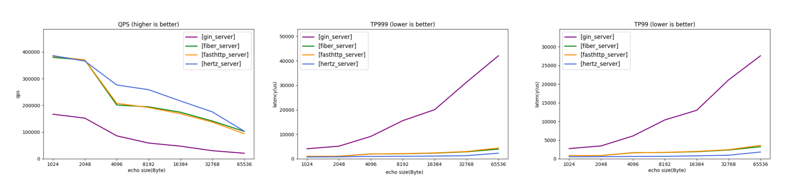
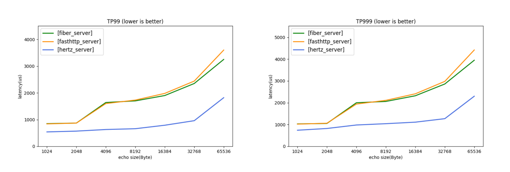

# Hertz

English | [中文](README_cn.md)

Hertz [həːts] is a high-usability, high-performance and high-extensibility Golang HTTP framework that helps developers build microservices. It was designed with reference to other open-source frameworks like [fasthttp](https://github.com/valyala/fasthttp), [gin](https://github.com/gin-gonic/gin), [echo](https://github.com/labstack/echo) and combined with the internal requirements in ByteDance. At present, it has been widely used inside ByteDance. Nowadays, more and more microservices use Golang. If you have requirements for microservice performance and hope that the framework can fully meet the internal customizable requirements, Hertz will be a good choice.
## Basic Features
- High usability

  During the development process, it is often more important to write the correct code quickly. Therefore, in the iterative process of Hertz, we actively listen to users' opinions and continue to polish the framework, hoping to provide users with a better user experience and help users write correct code faster.
- High performance

  Hertz uses the self-developed high-performance network library Netpoll by default. In some special scenarios, compared to Go Net, Hertz has certain advantages in QPS and time delay. For performance data, please refer to the Echo data in the figure below.

  Comparison of four frameworks:
  
  Comparison of three frameworks:
  
  For detailed performance data, please refer to [hertz-benchmark](https://github.com/cloudwego/hertz-benchmark).
- High extensibility

  Hertz adopts a layered design, providing more interfaces and default extension implementations. Users can also extend by themselves. At the same time, thanks to the layered design of the framework, the extensibility of the framework will be much greater. At present, only stable capabilities are open-sourced to the community. More planning refers to [RoadMap](ROADMAP.md).
- Multi-protocol support

  The Hertz framework provides HTTP1.1, ALPN protocol support natively. In addition, due to the layered design, Hertz even supports custom build protocol resolution logic to meet any needs of protocol layer extensions.
- Network layer switching capability

  Hertz implements the function to switch between Netpoll and Go Net on demand. Users can choose the appropriate network library for different scenarios. And Hertz also supports the extension of network library in the form of plug-ins.
## Documentation
### [Getting Started](https://www.cloudwego.io/docs/hertz/getting-started/)
### Example
  The Hertz-Examples repository provides code out of the box. [more](https://www.cloudwego.io/zh/docs/hertz/tutorials/example/)
### Basic Features
  Contains introduction and use of general middleware, context selection, data binding, data rendering, direct access, logging, error handling. [more](https://www.cloudwego.io/zh/docs/hertz/tutorials/basic-feature/)
### Service Governance
  Contains tracer monitor. [more](https://www.cloudwego.io/zh/docs/hertz/tutorials/service-governance/)
### Framework Extension
  Contains network library extensions. [more](https://www.cloudwego.io/zh/docs/hertz/tutorials/framework-exten/)
### Reference
  Apidoc, framework configurable items list. [more](https://www.cloudwego.io/zh/docs/hertz/reference/)
### FAQ
  Frequently Asked Questions. [more](https://www.cloudwego.io/zh/docs/hertz/faq/)
## Performance
  Performance testing can only provide a relative reference. In production, there are many factors that can affect actual performance.
  We provide the hertz-benchmark project to track and compare the performance of Hertz and other frameworks in different situations for reference.
## Related Projects
- [Netpoll](https://github.com/cloudwego/netpoll): A high-performance network library. Hertz integrated by default.
- [Hertz-Contrib](https://github.com/hertz-contrib): A partial extension library of Hertz, which users can integrate into Hertz through options according to their needs.
- [Example](https://github.com/cloudwego/hertz-examples): Use examples of Hertz.
## Extensions

| Extensions                                                                                         | Description                                                                                                                                                                    |
|----------------------------------------------------------------------------------------------------|--------------------------------------------------------------------------------------------------------------------------------------------------------------------------------|
| [Autotls](https://github.com/hertz-contrib/autotls)                                                | Make Hertz support Let's Encrypt.                                                                                                                                              |
| [Http2](https://github.com/hertz-contrib/http2)                                                    | HTTP2 support for Hertz.                                                                                                                                                       |
| [Websocket](https://github.com/hertz-contrib/websocket)                                            | Enable Hertz to support the Websocket protocol.                                                                                                                                |
| [Etag](https://github.com/hertz-contrib/etag)                                                      | Support ETag (or entity tag) HTTP response header for Hertz.                                                                                                                   |
| [Limiter](https://github.com/hertz-contrib/limiter)                                                | Provides a current limiter based on the bbr algorithm.                                                                                                                         |
| [Monitor-prometheus](https://github.com/hertz-contrib/monitor-prometheus)                          | Provides service monitoring based on Prometheus.                                                                                                                               |
| [Obs-opentelemetry](https://github.com/hertz-contrib/obs-opentelemetry)                            | Hertz's Opentelemetry extension that supports Metric, Logger, Tracing and works out of the box.                                                                                |
| [Opensergo](https://github.com/hertz-contrib/opensergo)                                            | The Opensergo extension.                                                                                                                                                       |
| [Pprof](https://github.com/hertz-contrib/pprof)                                                    | Extension for Hertz integration with Pprof.                                                                                                                                    |
| [Registry](https://github.com/hertz-contrib/registry)                                              | Provides service registry and discovery functions. So far, the supported service discovery extensions are nacos, consul, etcd, eureka, polaris, servicecomb, zookeeper, redis. |
| [Sentry](https://github.com/hertz-contrib/hertzsentry)                                             | Sentry extension provides some unified interfaces to help users perform real-time error monitoring.                                                                            |
| [Tracer](https://github.com/hertz-contrib/tracer)                                                  | Link tracing based on Opentracing.                                                                                                                                             |
| [Basicauth](https://github.com/cloudwego/hertz/tree/develop/pkg/app/middlewares/server/basic_auth) | Basicauth middleware can provide HTTP basic authentication.                                                                                                                    |
| [Jwt](https://github.com/hertz-contrib/jwt)                                                        | Jwt extension.                                                                                                                                                                 |
| [Keyauth](https://github.com/hertz-contrib/keyauth)                                                | Provides token-based authentication.                                                                                                                                           |
| [Requestid](https://github.com/hertz-contrib/requestid)                                            | Add request id in response.                                                                                                                                                    |
| [Sessions](https://github.com/hertz-contrib/sessions)                                              | Session middleware with multi-state store support.                                                                                                                             |
| [Casbin](https://github.com/hertz-contrib/casbin)                                                  | Supports various access control models by Casbin.                                                                                                                              |
| [Cors](https://github.com/hertz-contrib/cors)                                                      | Provides cross-domain resource sharing support.                                                                                                                                |
| [Csrf](https://github.com/hertz-contrib/csrf)                                                      | Csrf middleware is used to prevent cross-site request forgery attacks.                                                                                                         |
| [Secure](https://github.com/hertz-contrib/secure)                                                  | Secure middleware with multiple configuration items.                                                                                                                           |
| [Gzip](https://github.com/hertz-contrib/gzip)                                                      | A Gzip extension with multiple options.                                                                                                                                        |
| [I18n](https://github.com/hertz-contrib/i18n)                                                      | Helps translate Hertz programs into multi programming languages.                                                                                                               |
| [Lark](https://github.com/hertz-contrib/lark-hertz)                                                | Use hertz handle Lark/Feishu card message and event callback.                                                                                                                  |
| [Loadbalance](https://github.com/hertz-contrib/loadbalance)                                        | Provides load balancing algorithms for Hertz.                                                                                                                                  |
| [Logger](https://github.com/hertz-contrib/logger)                                                  | Logger extension for Hertz, which provides support for zap, logrus, zerologs logging frameworks.                                                                               |
| [Recovery](https://github.com/cloudwego/hertz/tree/develop/pkg/app/middlewares/server/recovery)    | Recovery middleware for Hertz.                                                                                                                                                 |
| [Reverseproxy](https://github.com/hertz-contrib/reverseproxy)                                      | Implement a reverse proxy.                                                                                                                                                     |
| [Swagger](https://github.com/hertz-contrib/swagger)                                                | Automatically generate RESTful API documentation with Swagger 2.0.                                                                                                             |
| [Cache](https://github.com/hertz-contrib/cache)                                                    | Hertz middleware for cache HTTP response with multi-backend support                                                                                                            |

## Blogs
- [ByteDance Practice on Go Network Library](https://www.cloudwego.io/blog/2021/10/09/bytedance-practices-on-go-network-library/)
- [Ultra-large-scale Enterprise-level Microservice HTTP Framework — Hertz is Officially Open Source!](https://www.cloudwego.io/zh/blog/2022/06/21/%E8%B6%85%E5%A4%A7%E8%A7%84%E6%A8%A1%E7%9A%84%E4%BC%81%E4%B8%9A%E7%BA%A7%E5%BE%AE%E6%9C%8D%E5%8A%A1-http-%E6%A1%86%E6%9E%B6-hertz-%E6%AD%A3%E5%BC%8F%E5%BC%80%E6%BA%90/)
- [ByteDance Open Source Go HTTP Framework Hertz Design Practice](https://www.cloudwego.io/zh/blog/2022/06/21/%E5%AD%97%E8%8A%82%E8%B7%B3%E5%8A%A8%E5%BC%80%E6%BA%90-go-http-%E6%A1%86%E6%9E%B6-hertz-%E8%AE%BE%E8%AE%A1%E5%AE%9E%E8%B7%B5/)
- [Help ByteDance Reduce Costs and Increase Efficiency, the Design Practice for Large-scale Enterprise-level HTTP Framework Hertz](https://www.cloudwego.io/zh/blog/2022/09/27/%E5%8A%A9%E5%8A%9B%E5%AD%97%E8%8A%82%E9%99%8D%E6%9C%AC%E5%A2%9E%E6%95%88%E5%A4%A7%E8%A7%84%E6%A8%A1%E4%BC%81%E4%B8%9A%E7%BA%A7-http-%E6%A1%86%E6%9E%B6-hertz-%E8%AE%BE%E8%AE%A1%E5%AE%9E%E8%B7%B5/)
- [A Practical Introduction to the HTTP Framework Hertz: A Guide to Performance Testing](https://www.cloudwego.io/zh/blog/2022/11/01/http-%E6%A1%86%E6%9E%B6-hertz-%E5%AE%9E%E8%B7%B5%E5%85%A5%E9%97%A8%E6%80%A7%E8%83%BD%E6%B5%8B%E8%AF%95%E6%8C%87%E5%8D%97/)
## Contributing

[Contributing](https://github.com/cloudwego/hertz/blob/main/CONTRIBUTING.md)
## RoadMap
[Hertz RoadMap](ROADMAP.md)
## License
Hertz is distributed under the [Apache License, version 2.0](https://github.com/cloudwego/hertz/blob/main/LICENSE). The licenses of third party dependencies of Hertz are explained [here](https://github.com/cloudwego/hertz/blob/main/licenses).
## Community
- Email: [conduct@cloudwego.io](conduct@cloudwego.io)
- How to become a member: [COMMUNITY MEMBERSHIP](https://github.com/cloudwego/community/blob/main/COMMUNITY_MEMBERSHIP.md)
- Issues: [Issues](https://github.com/cloudwego/hertz/issues)
- Slack: Join our CloudWeGo community [Slack Channel](https://join.slack.com/t/cloudwego/shared_invite/zt-tmcbzewn-UjXMF3ZQsPhl7W3tEDZboA).
- Lark: Scan the QR code below with [Lark](https://www.larksuite.com/zh_cn/download) to join our CloudWeGo/hertz user group.

## Contributors
Thank you for your contribution to Hertz!

## Landscapes

&nbsp;&nbsp;
  
CloudWeGo enriches the <a href="https://landscape.cncf.io/">CNCF CLOUD NATIVE Landscape</a>.

