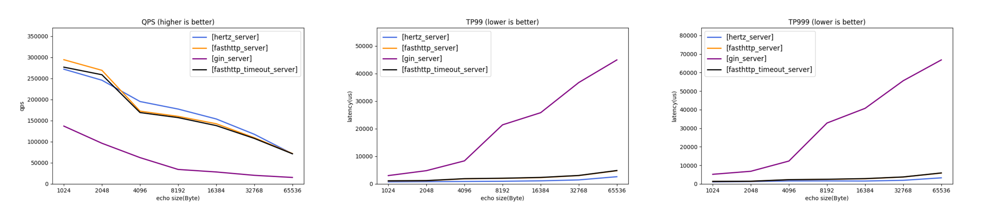

# Hertz

English | [中文](README_cn.md)

Hertz [həːts] is a high-usability, high-performance and high-extensibility Golang HTTP framework that helps developers build microservices. It was designed with reference to other open-source frameworks like [fasthttp](https://github.com/valyala/fasthttp)、[gin](https://github.com/gin-gonic/gin)、[echo](https://github.com/labstack/echo) and combined with the internal requirements in ByteDance. At present, it has been widely used inside ByteDance. Nowadays, more and more microservices use Golang. If you have requirements for microservice performance and hope that the framework can fully meet the internal customizable requirements, Hertz will be a good choice.
## Basic Features
- High usability

  During the development process, it is often more important to write the correct code quickly. Therefore, in the iterative process of Hertz, we actively listen to users' opinions and continue to polish the framework, hoping to provide users with a better user experience and help users write correct code faster.
- High performance

  Hertz uses the self-developed high-performance network library Netpoll by default. In some special scenarios, compared to Go Net, Hertz has certain advantages in QPS and time delay. For performance data, please refer to the Echo data in the figure below.
  
  For detailed performance data, please refer to [hertz-benchmark](https://github.com/cloudwego/hertz-benchmark).
- High extensibility

  Hertz adopts a layered design, providing more interfaces and default extension implementations. Users can also extend by themselves. At the same time, thanks to the layered design of the framework, the extensibility of the framework will be much greater. At present, only stable capabilities are open-sourced to the community. More planning refers to [RoadMap](ROADMAP.md).
- Multi-protocol support

  The Hertz framework provides HTTP1.1, ALPN protocol support natively. In addition, due to the layered design, Hertz even supports custom build protocol resolution logic to meet any needs of protocol layer extensions.
- Network layer switching capability

  Hertz implements the function to switch between Netpoll and Go Net on demand. Users can choose the appropriate network library for different scenarios. And Hertz also supports the extension of network library in the form of plug-ins .
## Documentation
### [Getting Started](https://www.cloudwego.io/docs/hertz/getting-started/)
### Example
  The Hertz-Examples repository provides code out of the box. [more](https://www.cloudwego.io/zh/docs/hertz/tutorials/example/)
### Basic Features
  Contains introduction and use of general middleware, context selection, data binding, data rendering, direct access, logging, error handling. [more](https://www.cloudwego.io/zh/docs/hertz/tutorials/basic-feature/)
### Service Governance
  Contains tracer monitor. [more](https://www.cloudwego.io/zh/docs/hertz/tutorials/service-governance/)
### Framework Extension
  Contains network library extensions. [more](https://www.cloudwego.io/zh/docs/hertz/tutorials/framework-exten/)
### Reference
  Apidoc, framework configurable items list. [more](https://www.cloudwego.io/zh/docs/hertz/reference/)
### FAQ
  Frequently Asked Questions. [more](https://www.cloudwego.io/zh/docs/hertz/faq/)
## Performance
  Performance testing can only provide a relative reference. In production, there are many factors that can affect actual performance.
  We provide the hertz-benchmark project to track and compare the performance of Hertz and other frameworks in different situations for reference.
## Related Projects
- [Netpoll](https://github.com/cloudwego/netpoll): A high-performance network library. Hertz integrated by default.
- [Hertz-Contrib](https://github.com/hertz-contrib): A partial extension library of Hertz, which users can integrate into Hertz through options according to their needs.
- [Example](https://github.com/cloudwego/hertz-examples): Use examples of Hertz.
## Blogs
- [ByteDance Practice on Go Network Library](https://www.cloudwego.io/blog/2021/10/09/bytedance-practices-on-go-network-library/)
## Contributing

[Contributing](https://github.com/cloudwego/hertz/blob/main/CONTRIBUTING.md)
## RoadMap
[Hertz RoadMap](ROADMAP.md)
## License
Hertz is distributed under the [Apache License, version 2.0](https://github.com/cloudwego/hertz/blob/main/LICENSE). The licenses of third party dependencies of Hertz are explained [here](https://github.com/cloudwego/hertz/blob/main/licenses).
## Community
- Email: [conduct@cloudwego.io](conduct@cloudwego.io)
- How to become a member: [COMMUNITY MEMBERSHIP](https://github.com/cloudwego/community/blob/main/COMMUNITY_MEMBERSHIP.md)
- Issues: [Issues](https://github.com/cloudwego/hertz/issues)
- Lark: Scan the QR code below with [Lark](https://www.larksuite.com/zh_cn/download) to join our CloudWeGo/hertz user group.

- Wechat: CloudWeGo community wechat group.

  
## Landscapes

&nbsp;&nbsp;
  
CloudWeGo enriches the <a href="https://landscape.cncf.io/">CNCF CLOUD NATIVE Landscape</a>.

